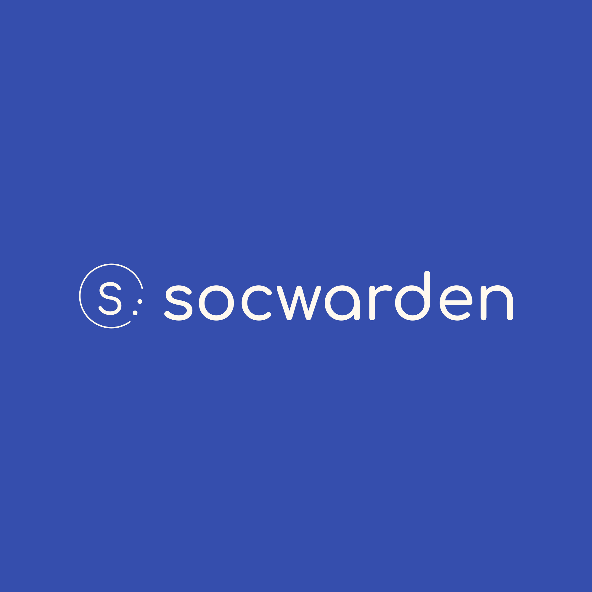

# SOCWarden 🛡️

**A personal Security Operations Center for monitoring and analyzing system activity.**

SOCWarden helps users keep track of system and network activity in real-time, detect suspicious behavior, and understand security events through clear explanations and guided responses.  

Key capabilities:

- Monitor logs and network activity on your machine  
- Detect unusual or suspicious behavior  
- Provide explanations and context for security events  
- Offer pre-planned response actions for safe experimentation  
- Visualize activity through an intuitive dashboard  

SOCWarden is **offline-first and privacy-conscious**, giving you practical insights without exposing your data to external services.  

---

## 🚀 Features

- **Real-Time Monitoring:** Track system and network activity as it happens  
- **Event Analysis:** Understand the nature and context of suspicious events  
- **Response Guidance:** Pre-planned actions to respond safely to incidents  
- **Visual Dashboard:** Quick, clear insights into activity trends and alerts  
- **Optional Sandbox Mode:** Test scenarios safely without affecting your system  

---

## 🏗️ Tech Stack

- **Languages:** Python, C#  
- **Systems:** Windows, Linux  
- **Tools:** Git, Docker (optional), local AI modules  

---

## 📌 License

This project is licensed under the MIT License – see the [LICENSE](LICENSE) file for details.
